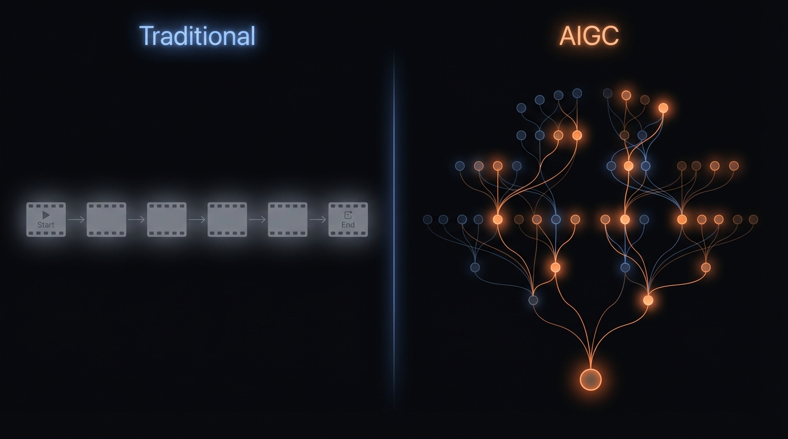
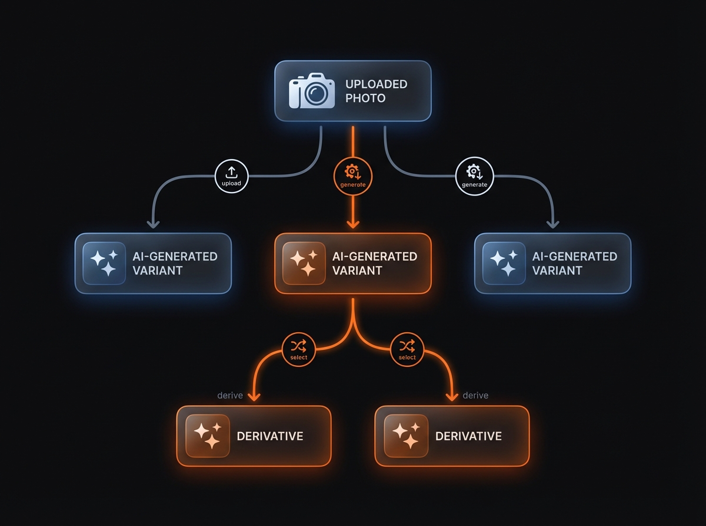
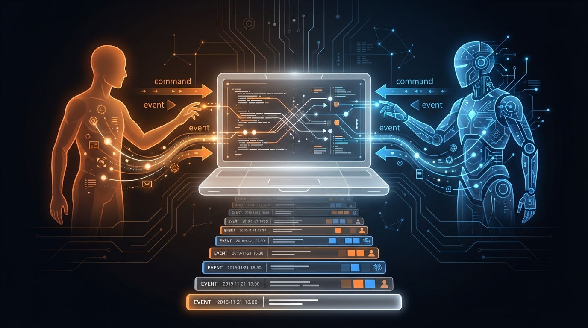
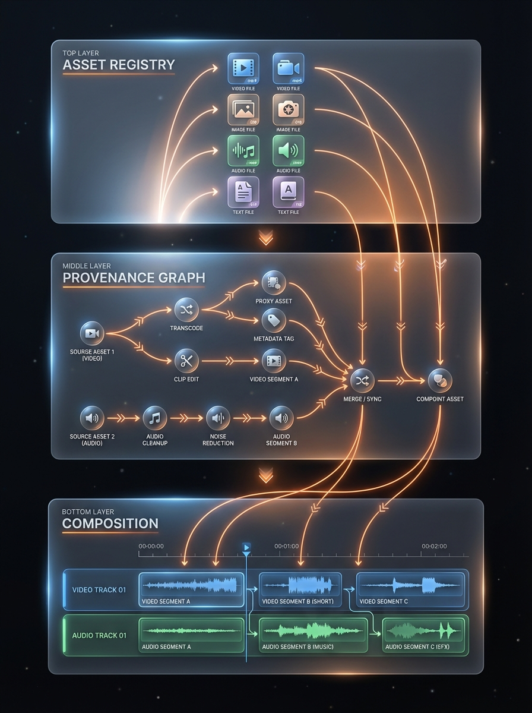
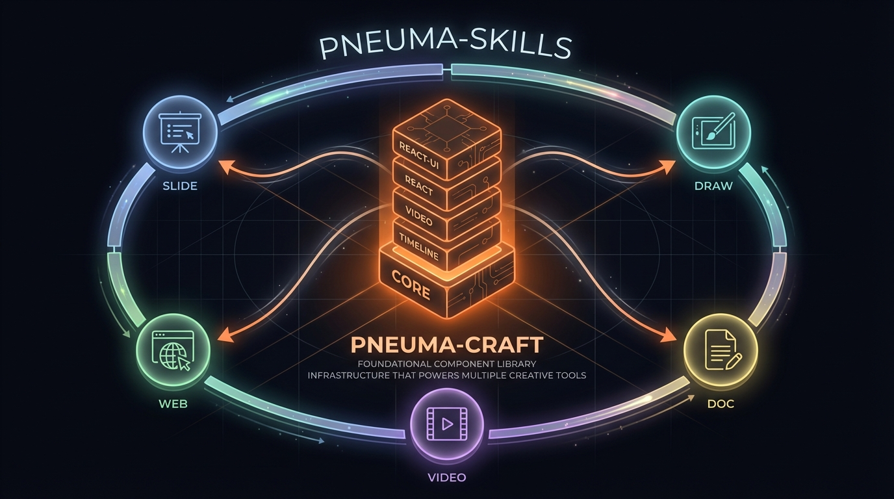

# Why pneuma-craft?

## The Problem: Content Creation Has Changed, but Tools Haven't

When AI enters the content creation loop, the workflow is fundamentally different from traditional editing.



**Traditional editing** is linear: one author, one timeline, sequential edits. Undo is a stack. Assets are just files.

**AIGC creation** is a tree: Agent generates multiple variants. Human reviews and selects. Agent iterates on the selection. This cycle repeats, producing a **branching tree of versions** — not a linear history.

Existing tools don't model this. Premiere doesn't know "these three clips are AI-generated variants of the same scene." CapCut doesn't track "this video was generated from that image using Sora."

---

## Core Insight: Provenance is the Missing Primitive



In AIGC workflows, every asset has a story:
- **Where it came from** — uploaded by human? Generated by agent? Derived from another asset?
- **How it was created** — which model, what parameters, what prompt?
- **What it produced** — what variants were generated from it? Which one was selected?

This is **provenance** — the complete lineage of an asset. Traditional editors don't track it because they don't need to. When a single human drags files onto a timeline, the lineage is obvious: "I put it there."

But when agents generate content, provenance becomes critical:
- **Audit**: Who created this? Human or agent?
- **Reproducibility**: Can I regenerate this with different parameters?
- **Version management**: Which variant did we pick, and why?
- **Collaboration**: The agent needs to know what the human selected to produce better next iterations.

pneuma-craft makes provenance a **first-class citizen** in the data model, not an afterthought.

---

## The Solution: Shared Infrastructure for Human-Agent Collaboration



In pneuma-craft, humans and agents share the **exact same command interface**:

```
Command → CommandHandler → Event(s) → EventStore → State
```

- Both emit commands (`asset:register`, `composition:add-clip`, `provenance:link`)
- Both produce immutable events
- Every event carries `actor: 'human' | 'agent'`
- The event log only grows (undo emits compensating events, never deletes)
- State is a projection of the event log — always consistent, always auditable

This means:
- The agent's actions are fully transparent — you can see exactly what it did
- The human can undo any agent action, or vice versa
- The event log is a complete audit trail of the collaboration

---

## Architecture: Three-Layer Domain Model



pneuma-craft separates concerns into three layers:

| Layer | What it knows | What it doesn't care about |
|-------|--------------|---------------------------|
| **Asset Registry** | What exists — all media assets, metadata, tags | How they got here, how they're arranged |
| **Provenance Graph** | How assets evolved — the DAG of operations | How they're arranged in the final output |
| **Composition** | The final output — tracks, clips, timeline | How assets were created |

Each layer builds on the one above. This separation means:
- You can have provenance without a timeline (e.g., an image curation tool)
- You can have a timeline without provenance (e.g., a simple editor)
- Or you can use all three (e.g., a full video production suite)

---

## Ecosystem: Where pneuma-craft Fits



pneuma-craft is a **foundational component library** — not a complete application.

It is extracted from and consumed by [pneuma-skills](https://github.com/pandazki/pneuma-skills), the co-creation platform for humans and code agents. pneuma-skills provides the visual environment, agent runtime, and skill system. pneuma-craft provides the domain model and viewer components.

The four packages stack from bottom to top:

```
@pneuma-craft/react       ← React 19 bindings (hooks, providers, headless components)
@pneuma-craft/video       ← Video engine (decode, composite, playback, export)
@pneuma-craft/timeline    ← Composition model (tracks, clips, time-based arrangement)
@pneuma-craft/core        ← Domain model (asset registry, provenance graph, events)
```

Core, timeline, and video are **pure TypeScript** — no React, no DOM assumptions. They can run in Workers, Node.js, or any framework. The React layer is optional. You use only what you need.

---

## What pneuma-craft Is Not

- **Not a video editor** — it's the domain infrastructure that video editors can be built on
- **Not an AI service** — it doesn't call LLMs, generate content, or manage prompts
- **Not an opinionated UI** — the headless layer lets you build any interface
- **Not just for video** — the asset registry and provenance graph work for any content type

It is the **workspace where AI-generated and human-created content meets, gets organized, and becomes a final product.**
